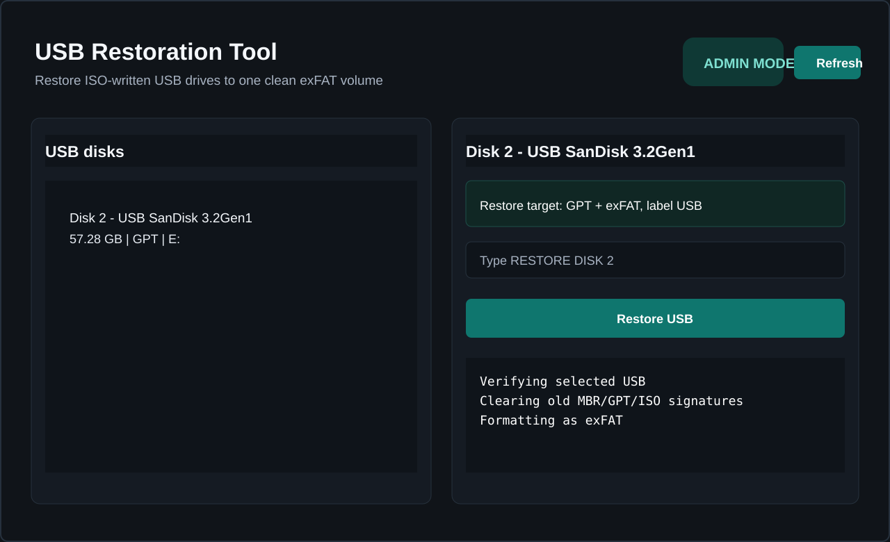
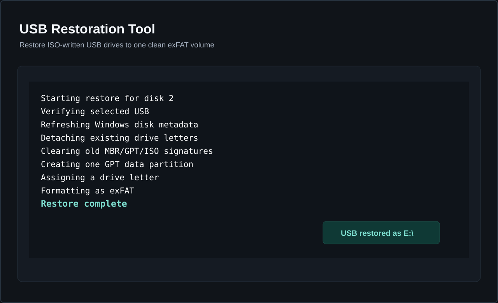

# USB Restoration Tool

A Windows-only Qt 6 desktop app for restoring USB drives after they were modified by ISO writers, Linux installers, or boot media tools.

The app restores a selected USB disk to one normal **GPT + exFAT** volume labeled `USB`. It avoids PowerShell and DiskPart for the restore path and uses Windows APIs directly for volume detaching, raw disk cleanup, GPT partition creation, volume mounting, and WMI-based exFAT formatting.





## Download

Get the latest portable ZIP from:

[GitHub Releases](https://github.com/KaroqDave/USB-Restoration-Tool/releases/latest)

Extract the ZIP and run `USBRestorationTool.exe`. The app requests Administrator permission because raw disk restore operations require elevation.

## Safety Model

- Only USB bus disks are listed.
- Boot/system disks and disks containing `C:` are refused.
- Offline and read-only disks are refused.
- The selected disk is revalidated immediately before destructive work.
- The restored volume is revalidated before formatting.
- Large USB disks show an extra warning.
- Restore requires typing `RESTORE DISK <number>`.
- Restore never starts automatically.

Restoring a drive erases every partition and file on the selected USB drive.

## Build Prerequisites

- Windows x64
- Visual Studio 2022 or 2026 Build Tools with MSVC x64
- CMake 3.24 or newer
- Qt 6 MSVC x64, including Qt Widgets and Qt Test
- `windeployqt` from the same Qt installation

The local development setup uses:

```text
.deps\Qt\6.10.1\msvc2022_64
```

## Build

```powershell
.\scripts\build-release.ps1 -QtDir ".\.deps\Qt\6.10.1\msvc2022_64"
```

The executable is built under:

```text
build\Release\USBRestorationTool.exe
```

## Package

```powershell
.\scripts\package-release.ps1 -QtDir ".\.deps\Qt\6.10.1\msvc2022_64"
```

The portable ZIP is written to:

```text
release\USB-Restoration-Tool-v0.1.0-windows-x64.zip
```

The release folder includes a `SHA256SUMS.txt` file covering every bundled file.

For public releases, sign the executable:

```powershell
.\scripts\package-release.ps1 `
  -QtDir ".\.deps\Qt\6.10.1\msvc2022_64" `
  -Sign `
  -CertificateThumbprint YOUR_THUMBPRINT `
  -RequireSignature
```

See [SIGNING.md](SIGNING.md).

## VS Code

This repository includes VS Code settings and tasks:

- `Build Release`
- `Package Release`
- `Run Tests`

Install the recommended extensions from `.vscode/extensions.json`, then use `Terminal > Run Task`.

## Tests

```powershell
cmake -S . -B build -G "Visual Studio 17 2022" -A x64 -DCMAKE_PREFIX_PATH=".\.deps\Qt\6.10.1\msvc2022_64"
cmake --build build --config Release
ctest --test-dir build -C Release --output-on-failure
```

The automated tests cover pure safety and layout logic. Do not run a real restore unless you are using a known disposable USB drive.

## Project Status

Version `0.1.0` has been manually validated on a disposable USB that had previously contained a Linux installer image. A trusted code-signing certificate is still required for polished public distribution.
